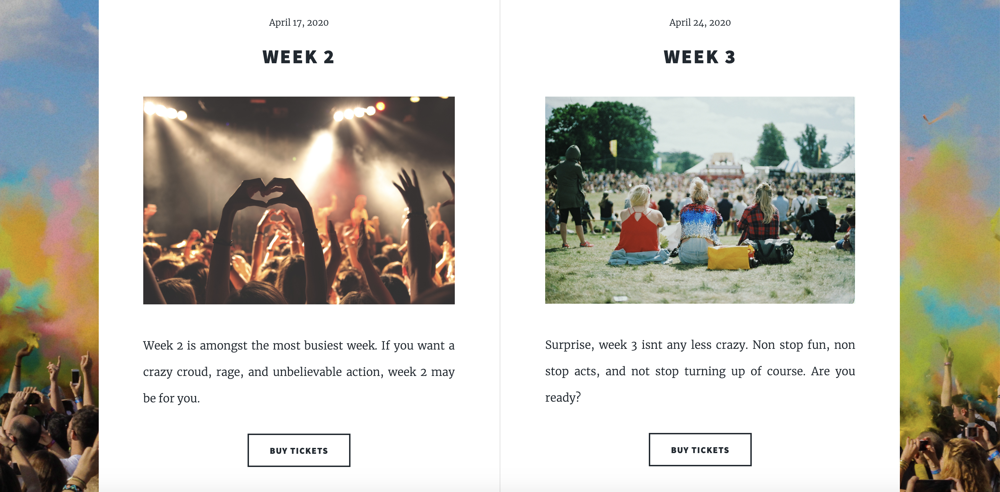
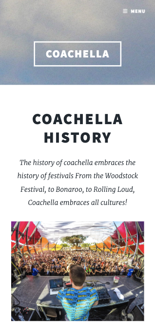
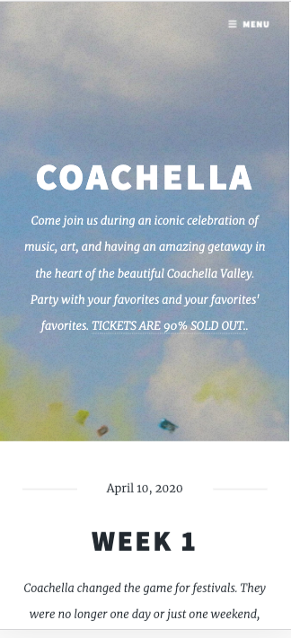
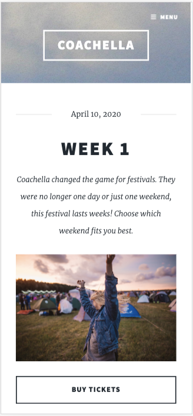
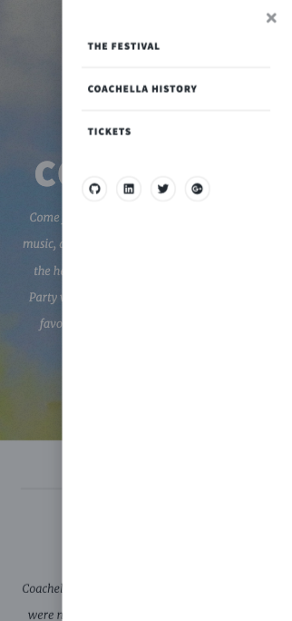
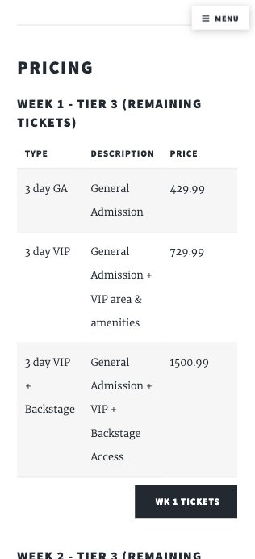

# Coachella

This is a Coachella/Festival concept. When I was contacted by a recuiter from Live Nation for a Frontend remote position, a light bulb went off andf I simply wanted to see how fast I could create festival's site. These are the types of challenges that I put myself through daily. I gave myself less than one day, within a moments notice. This type of implementation is what has propelled me constantly in the industry to be above standards and always ahead of the curve.  

## Technologies Used:
____

* HTML5, CSS3, SASS, JavaScript, jQuery

## Live Link
___

[CLICK HERE TO VIEW](https://coachellafest.netlify.com/)

## Quick Site Glance :
____

### Desktop

### Mobile

